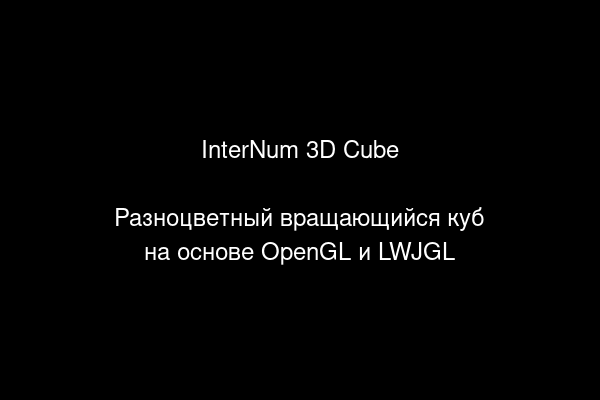

# InterNum - Самодостаточные Java-приложения

## О проекте

InterNum - это демонстрационный проект, показывающий, как создавать полностью самодостаточные исполняемые файлы из Java-приложений, которые можно запускать на Windows без установки Java и без распаковки дополнительных файлов.

## Возможности

- **Полная независимость** - не требует установки Java на компьютере пользователя
- **Один файл** - не требует распаковки дополнительных файлов перед запуском
- **Без следов** - не оставляет временных файлов после завершения работы
- **Простота использования** - запускается одним щелчком мыши
- **Кроссплатформенность** - поддерживает Windows, Linux и macOS (с разными методами упаковки)

## Демонстрационное приложение

Проект включает простое 3D-приложение с вращающимся кубом, использующее LWJGL (Lightweight Java Game Library) и OpenGL:

## Скачать

Вы можете скачать готовые сборки из раздела [Releases](https://github.com/mystergaif/internum/releases):

- **InterNumApp_Standalone.exe** - полностью самодостаточный EXE-файл для Windows
- **InterNumApp_Standalone_Debug.exe** - отладочная версия с логированием
- **internum-app-1.0-SNAPSHOT.jar** - JAR-файл для запуска на системах с установленной Java 17

## Документация

Полная документация доступна в [README.md](https://github.com/mystergaif/internum/blob/main/README.md) репозитория.

### Создание EXE из вашего JAR-файла

В репозитории есть подробное руководство по созданию самодостаточных EXE-файлов из ваших JAR-файлов с использованием различных методов:

1. **NSIS** - создание самодостаточного EXE с встроенной JRE
2. **Launch4j** - создание EXE-обертки для JAR-файла
3. **Maven Shade Plugin** - создание "fat JAR" со всеми зависимостями
4. **jpackage** - создание нативных установщиков с помощью инструмента из JDK 14+

[Подробное руководство](https://github.com/mystergaif/internum#-руководство-по-созданию-exe-из-вашего-jar-файла)

## Исходный код

Исходный код проекта доступен на [GitHub](https://github.com/mystergaif/internum).

## Лицензия

Этот проект распространяется под лицензией MIT. См. файл [LICENSE](https://github.com/mystergaif/internum/blob/main/LICENSE) для получения дополнительной информации.

## Автор

MisterGaif - [GitHub](https://github.com/mystergaif)
